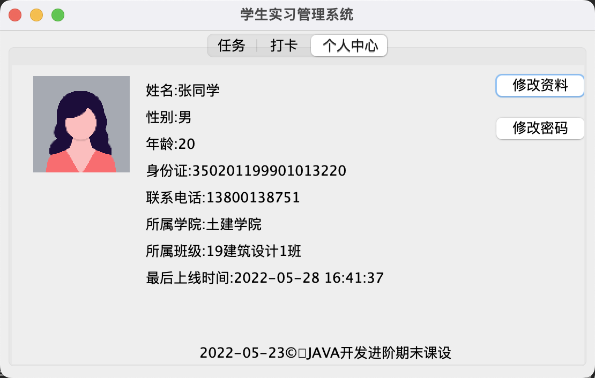
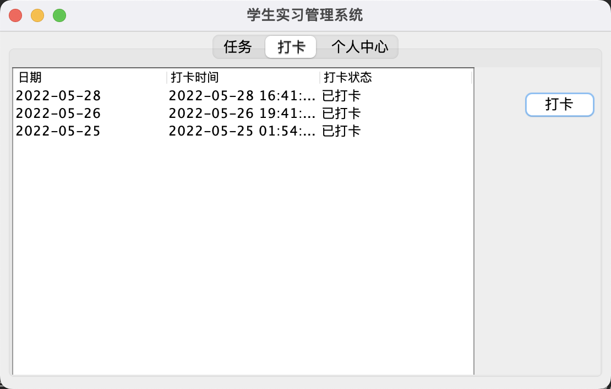
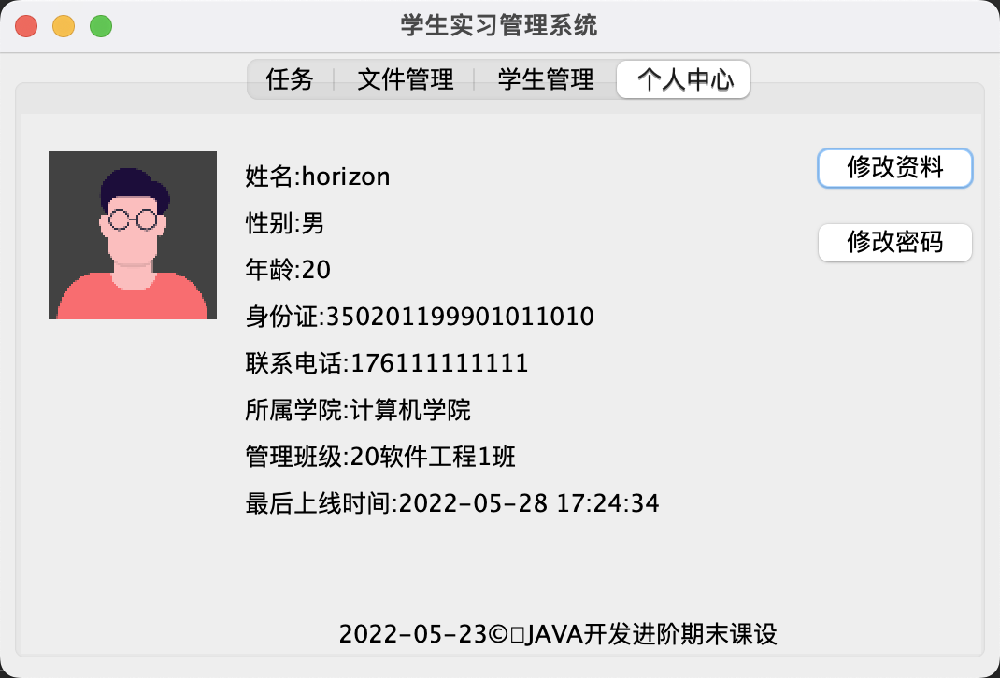
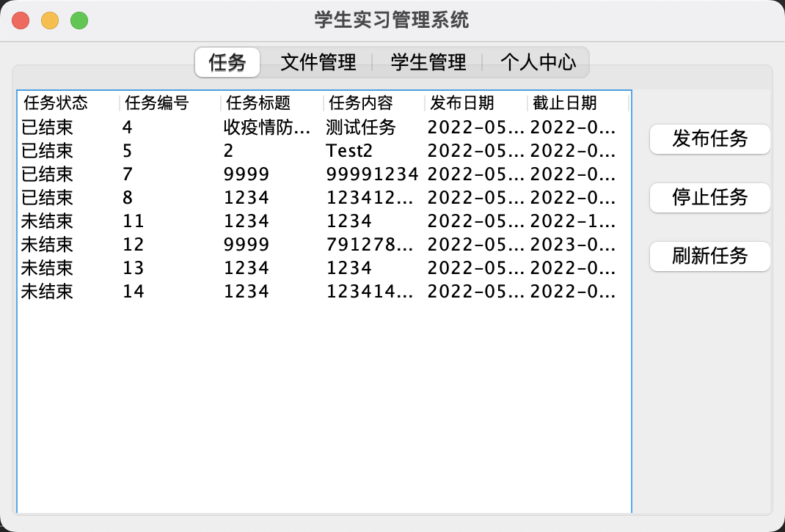
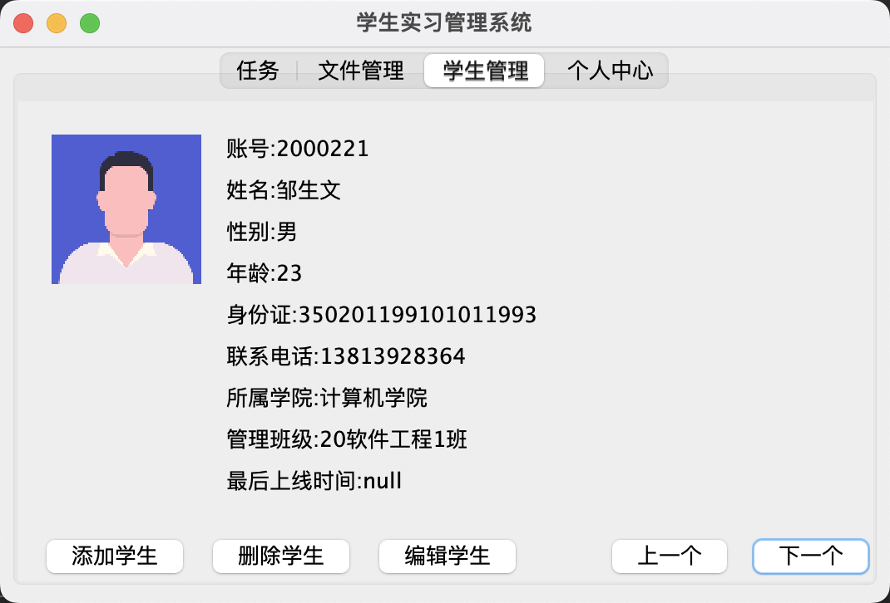

# 《JAVA开发进阶》 期末课设

🇨🇳 中文简体  |  <a title="English" href="README_en.md">🇬🇧 English</a>

## 环境

系统：macOS Monterey Version12.4

集成开发环境：IntelliJ IDEA 2022.1.1 (uitimate Edition)

JDK:1.8 Maven

插件：JFormDesigner 20 Day Free

时限:2022年5月23日-2022年5月28日

## 选题

**学生实习管理系统**

- 学生端
  
  - 上传文件 / 完成任务
  
  - 打卡
  
  - 查看/编辑个人资料

- 教师端
  
  - 下载文件
  
  - 发布任务
  
  - 添加/删除学生（批量）
  
  - 编辑学生资料
  
  - 查看/编辑个人资料

## 思路

基本的数据库增删改查操作，文件上下载使用FTP

## 图片

- 登录界面

- 学生个人资料界面

- 学生打卡界面
  s
  

- 教师个人资料界面

- 教师任务管理界面

- 教师学生管理界面

## 数据库

<a href="SQL/2022-06-01_11_45_29 AM.pdf" >数据库说明文档</a>

## FTP

路径：/files
