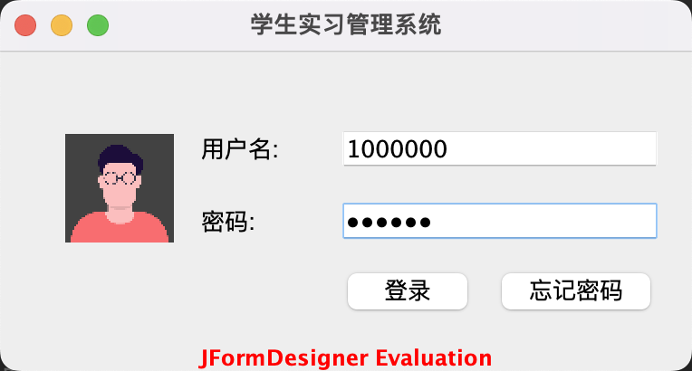
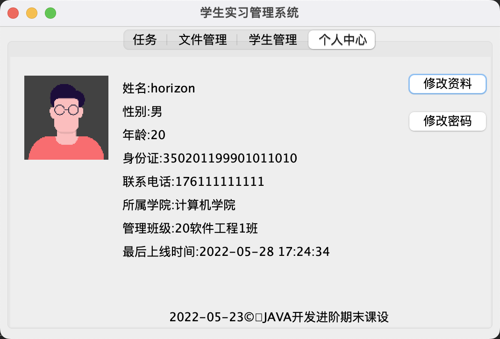
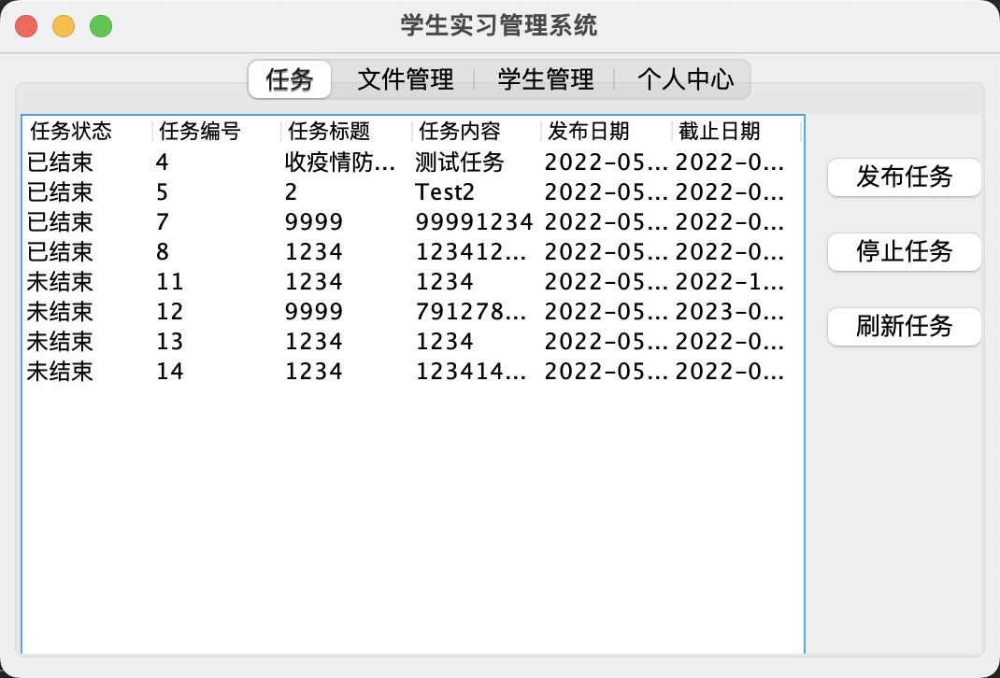
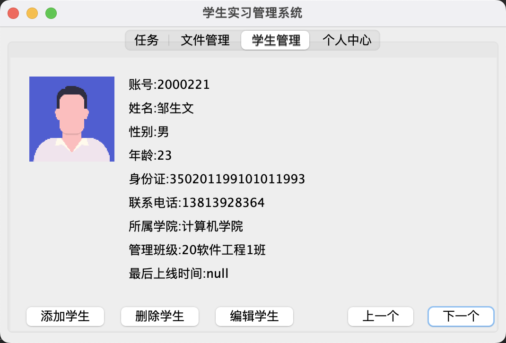

# The final course of "JAVA Development Advanced"

<a title="English" href="README_en.md">🇨🇳 中文简体</a>  |  🇬🇧 English

The project will be moved to the College warehouse as part of the College warehouse in August 2022

## Environment

System：macOS Monterey Version12.4

IDE：IntelliJ IDEA 2022.1.1 (uitimate Edition)

JDK:1.8 Maven

Plug-in：JFormDesigner 20 Day Free

Date:23 May 2022-28 May 2022

## Select the topic

**Student practice management system**

- Student
  
  - Upload files / complete tasks
  
  - Sign in
  
  - View / edit personal data

- Teacher
  
  - Download a file
  
  - Publish task
  
  - Add / remove students (batch)
  
  - Edit student information
  
  - View / edit personal data

## ideas

Basic database addition, deletion, modification and search operations, using FTP for file upload and download

## Photo

- Login Page

- Student personal data interface

- Student sign-in interface

- Teacher's personal data interface

- Teacher task management interface

- Teacher:student management interface

## Database Description

<a href="SQL/2022-06-01_11_45_29 AM.pdf"> Database Description PDF </a>

## FTP Description
Route: /files

